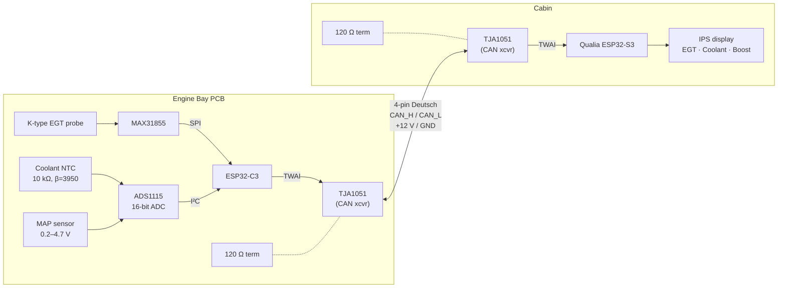
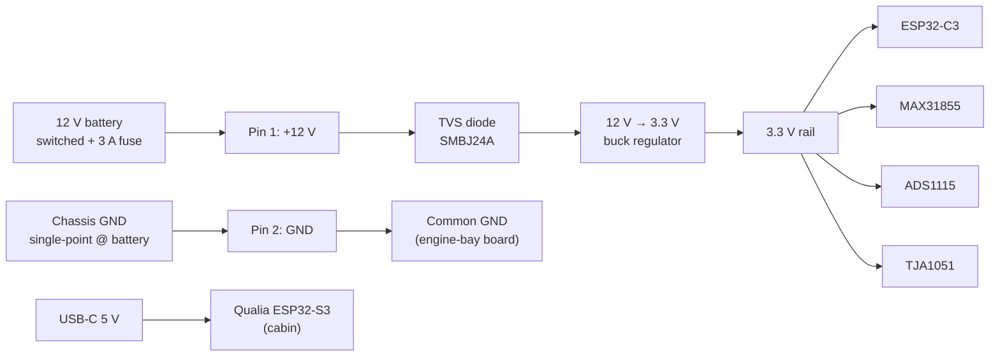
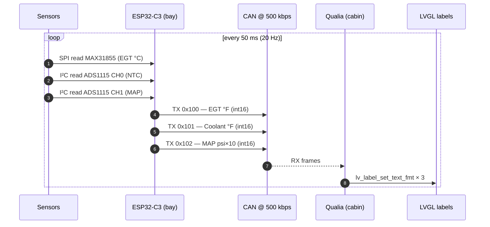

# Simple Gauge for Qualia ESP32-S3

This repository contains a minimal three-parameter automotive gauge running on an Adafruit **Qualia ESP32-S3** and its built-in IPS display.

## Parameters Displayed

| Sensor | Range | Notes |
| ------ | ----- | ----- |
| EGT (thermocouple) | up to 1800 °F | MAX31855 SPI amplifier |
| Coolant Temperature | –40 °F – 300 °F | 10 kΩ NTC thermistor, Steinhart–Hart |
| Boost / MAP | 0 – 29 psi | MPX2200GP analog pressure |

## System Block Diagram

Two MCUs, linked by CAN over a 4-pin Deutsch harness. Sensors terminate
locally on the engine-bay board (notably the K-type thermocouple — MAX31855
does cold-junction comp at its own die, so co-locating with the connector
is more accurate than running extension wire to the cabin). The cabin
Qualia is a CAN listener that updates the display.



## Harness Pinout (DT04-4P)

| Pin | Signal | Dir | Notes |
| --- | ------ | --- | ----- |
| 1 | +12 V (switched) | → | Fused upstream (3 A), feeds engine-bay buck |
| 2 | GND | — | Chassis ground, single-point at battery |
| 3 | CAN_H | ↔︎ | Twisted pair with CAN_L, 120 Ω term each end |
| 4 | CAN_L | ↔︎ | Twisted pair with CAN_H |

## Cabin ESP32-S3 (Qualia) Pin Map

| Function | Pin |
| -------- | --- |
| TFT SCK | GPIO36 |
| TFT MOSI | GPIO35 |
| TFT MISO | GPIO33 |
| TFT CS | GPIO34 |
| TFT DC | GPIO37 |
| TFT RST | GPIO38 |
| CAN TX (TWAI) | GPIO5 |
| CAN RX (TWAI) | GPIO6 |

## Engine-Bay ESP32-C3 Pin Map

(Pins chosen to avoid the SuperMini's onboard LED on GPIO8 and the boot
button on GPIO9, and the USB-Serial pins GPIO20/21.)

| Function | Pin |
| -------- | --- |
| MAX31855 SCK | GPIO4 |
| MAX31855 MISO | GPIO5 |
| MAX31855 CS | GPIO10 |
| ADS1115 SDA | GPIO6 |
| ADS1115 SCL | GPIO7 |
| CAN TX (TWAI) | GPIO0 |
| CAN RX (TWAI) | GPIO1 |

## Calibration Constants

Thermistor β: **3950 K**  |  Series resistor: **10 kΩ @ 25 °C**  |  MAP: 0.2 V → 0 psi, 4.7 V → 29 psi

## Power Supply

The cabin Qualia runs off USB-C (or its own switched-12 V→5 V adapter). The
engine-bay board is fed switched **12 V** through pin 1 of the Deutsch
harness, fused at ~3 A upstream, and steps it down locally with a 12 V→3.3 V
buck. Single-point ground at the battery; TVS diode on the engine-bay 12 V
input for load-dump protection.



## Firmware Layout

Single PlatformIO project, two environments selected via `build_src_filter`:

```
shared/can_protocol.h          # frame IDs + payload conventions
src/cabin/                     # env: cabin (Qualia ESP32-S3)
  main.cpp · ui.{cpp,h} · can_rx.{cpp,h}
src/engine_bay/                # env: engine-bay (ESP32-C3 SuperMini)
  main.cpp · sensors.{cpp,h} · can_tx.{cpp,h}
```

- **`engine-bay`** reads MAX31855 + ADS1115 and publishes three CAN frames
  every 50 ms (`0x100` EGT, `0x101` Coolant, `0x102` MAP×10) at 500 kbps.
- **`cabin`** is a TWAI listener that drives an LVGL UI: a boost arc gauge
  at the top with EGT and coolant numerics below. Values turn amber at
  warning thresholds (EGT 1300 °F, coolant 220 °F, boost 20 psi) and red
  at danger (1500 / 240 / 27 psi).



Proposed CAN frame layout (1 byte priority, 2 bytes value, big-endian):

| ID | Field | Units | Type | Range |
| --- | --- | --- | --- | --- |
| `0x100` | EGT | °F | `int16` | 0 – 1800 |
| `0x101` | Coolant | °F | `int16` | -40 – 300 |
| `0x102` | MAP | psi × 10 | `int16` | 0 – 290 |

## Build / Flash

```bash
# Cabin (Qualia ESP32-S3) — display + CAN listener
pio run -e cabin -t upload

# Engine bay (ESP32-C3 SuperMini) — sensor reads + CAN publisher
pio run -e engine-bay -t upload

# Serial monitor
pio device monitor -e cabin            # or -e engine-bay
```

The cabin's display init in `src/cabin/main.cpp` currently calls
`tft.init(240, 240)` — adjust to match the Qualia panel variant in hand
(480×480 round IPS vs. 320×240 ST7789 vs. 240×240).