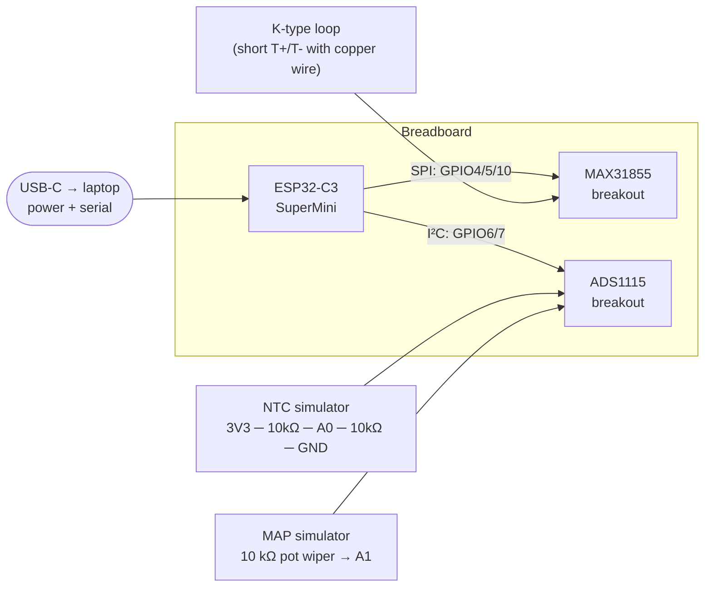
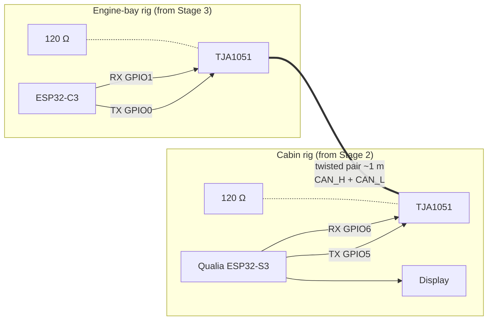
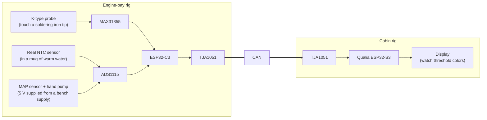

# Bench Testing Guide

Walks the system up from nothing to a fully-integrated CAN-linked gauge,
**before** ordering PCBs. Each stage gates the next — don't move on
until the previous one's pass criteria are met.

## What you'll need

For a US-supplier shopping list with links + costs, see
[`BENCH_BOM.md`](BENCH_BOM.md). The quick version:

**Hardware**

| Item | Used in stage |
| ---- | ------------- |
| Adafruit Qualia ESP32-S3 + USB-C cable | 2, 4, 5 |
| ESP32-C3 SuperMini + USB-C cable | 3, 4, 5 |
| Adafruit MAX31855 breakout (PID 269) | 3, 4, 5 |
| Adafruit ADS1115 breakout (PID 1085) | 3, 4, 5 |
| Two TJA1051 / SN65HVD230 modules | 4, 5 |
| K-type thermocouple wire (a short loop also works) | 3, 5 |
| 10 kΩ resistor (×3 for divider sims, ×1 for NTC sim) | 3 |
| 10 kΩ trim pot or linear pot | 3 |
| 120 Ω resistors (×2 for CAN termination) | 4, 5 |
| Twisted pair wire, ~1 m | 4, 5 |
| Breadboard + jumpers | 3, 4 |
| MAP sensor + hand vacuum/pressure pump | 5, 6 |
| Real automotive NTC (or thermistor of known curve) | 5 |
| Cup of warm water + thermometer | 5 |

**Software**

- PlatformIO Core (`pip install platformio`) or the VS Code extension.
- A serial monitor (PlatformIO has one: `pio device monitor`).

---

## Stage 1 — Compile both environments

No hardware needed yet.

```bash
git clone <this repo>
cd junkr-obd
pio run -e cabin
pio run -e engine-bay
```

**Pass criterion:** Both environments produce a `.pio/build/<env>/firmware.bin`
with no errors.

### Common Stage-1 fixes

| Symptom | Fix |
| ------- | --- |
| `Adafruit_MAX31855.h: No such file` | First build downloads libs; run again, or `pio pkg install -e engine-bay`. |
| `lv_font_montserrat_36 undefined` | Confirm `platformio.ini` still has the `-DLV_FONT_MONTSERRAT_36=1` flag under `[env:cabin]`. |
| TWAI / `driver/twai.h` missing | Update `platform = espressif32 @ ^6.0` to pull arduino-esp32 ≥ 2.0.5. |
| `can_protocol.h: No such file` | Make sure `[env] build_flags = -I shared` survived edits. |

---

## Stage 2 — Cabin UI alone

Just the Qualia + USB. Confirms the display + LVGL layout works before
any CAN comes into the picture.

```bash
pio run -e cabin -t upload
pio device monitor -e cabin
```

**Pass criteria:**

- Display renders the boost arc gauge at the top with `0.0 psi` in the center.
- Two numeric placeholders below: `EGT  F  ---` (left) and `COOLANT  F  ---` (right).
- Serial prints `[cabin] TWAI init failed` — **this is expected**, no
  transceiver is connected yet.
- Layout fits the panel — no clipping, no off-screen text.

### If the display is blank / wrong size

The Qualia ships in a few panel variants. `src/cabin/main.cpp:24` has
`tft.init(240, 240)` as a default. Change to match what's actually on
your board:

| Variant | Init call |
| ------- | --------- |
| 1.5" round IPS, 480×480 | `tft.init(480, 480)` (and likely a different driver — see Adafruit's Qualia docs) |
| 1.3" square ST7789, 240×240 | `tft.init(240, 240)` |
| 1.9" ST7789, 320×170 | `tft.init(170, 320); tft.setRotation(1)` |

Rebuild, reupload, recheck.

---

## Stage 3 — Engine-bay reads alone

ESP32-C3 + the two sensor breakouts on a breadboard, with simulated
sensor inputs. CAN transceiver is not connected yet — we use the
`engine-bay-debug` environment so values stream out the serial.



### Wiring table

Power rails on the breadboard: one 3.3 V rail (from the C3's `3V3` pin)
and one GND rail.

**MAX31855 breakout**

| Breakout pin | Goes to |
| ------------ | ------- |
| VIN | 3.3 V rail |
| GND | GND rail |
| CLK | C3 GPIO4 |
| DO  | C3 GPIO5 |
| CS  | C3 GPIO10 |
| 3Vo | leave open |
| T+, T− | short together with a copper wire loop, **or** clip a K-type probe |

**ADS1115 breakout**

| Breakout pin | Goes to |
| ------------ | ------- |
| VDD | 3.3 V rail |
| GND | GND rail |
| SDA | C3 GPIO6 |
| SCL | C3 GPIO7 |
| ADDR | GND rail (selects address `0x48`) |
| ALRT | leave open |
| A0 | NTC simulator tap (see below) |
| A1 | MAP simulator wiper |
| A2, A3 | leave open |

**NTC simulator** (drops the voltage divider exactly at room-temp
midpoint, so coolant should read ~77 °F):

```
3.3V rail ── 10 kΩ ──┬── A0
                     │
                     ── 10 kΩ ── GND rail
```

**MAP simulator**: connect a 10 kΩ pot between 3.3 V and GND, wiper to
A1. Sweep it to test the full range.

### Upload + monitor

```bash
pio run -e engine-bay-debug -t upload
pio device monitor -e engine-bay-debug
```

**Pass criteria** (the debug print lands every 1 s):

```
EGT=72 F  Coolant=77 F  MAP=0.0 psi     <- pot at 0V
EGT=72 F  Coolant=77 F  MAP=14.5 psi    <- pot at midpoint (~1.18V)
EGT=72 F  Coolant=77 F  MAP=29.0 psi    <- pot at 2.35V (top of valid range)
```

- EGT should be roughly room temperature when T+/T− are shorted (MAX31855
  reports the cold-junction temp).
- Coolant should be ~77 °F with the 10 kΩ-10 kΩ divider on A0.
- MAP should sweep 0.0 → 29.0 psi as you turn the pot from GND to ~2.35 V
  (the firmware constants now assume the on-PCB 2:1 divider — see
  `src/engine_bay/sensors.cpp:21-23`).

### Stage-3 gotchas

| Symptom | Likely cause |
| ------- | ------------ |
| EGT reads `NaN` or `-32768` | Thermocouple disconnected; MAX31855 fault. Check T+/T− short. |
| Coolant reads `-32768` | Voltage at A0 is below 0.05 V or above 3.25 V — divider not actually 50/50. |
| I²C errors / ADS reads zero | Forgot to tie ADDR to GND, or pull-ups missing (Adafruit breakout has onboard pull-ups — confirm jumper). |
| C3 keeps rebooting | GPIO0/1 momentarily floating at boot. Should be fine once TWAI starts. |

---

## Stage 4 — CAN loopback

Now wire both MCUs together over a short twisted pair through their
respective TJA1051 transceivers. Real sensors still aren't connected —
the engine-bay rig keeps the Stage-3 simulators.



### Wiring (both transceiver modules)

Same on both ends — engine-bay side connects to C3, cabin side to Qualia:

| TJA1051 pin | Engine-bay (C3) | Cabin (Qualia) |
| ----------- | --------------- | -------------- |
| VCC | 3.3 V | 3.3 V |
| GND | GND | GND |
| TXD | GPIO0 | GPIO5 |
| RXD | GPIO1 | GPIO6 |
| S (silent) | GND | GND |
| CANH | twisted pair → other end CANH | ← |
| CANL | twisted pair → other end CANL | ← |

Drop a **120 Ω resistor across CANH–CANL at each end** of the twisted pair.

Re-flash:

```bash
pio run -e engine-bay-debug -t upload      # uploads to C3 (one USB cable)
pio run -e cabin -t upload                 # uploads to Qualia (the other USB cable)
```

**Pass criteria:**

- Cabin's serial no longer says `[cabin] TWAI init failed`.
- Cabin display **updates with the Stage-3 simulator values** at ~20 Hz.
  Turn the pot — boost arc on the cabin moves immediately.
- Engine-bay debug serial keeps printing the same values, confirming TX
  is happening (the C3 sees no errors → frames are being ACK'd by the
  cabin end).

### Stage-4 gotchas

| Symptom | Likely cause |
| ------- | ------------ |
| Cabin display stays at `---` | One of the TJA1051 S-pins floating — must be tied to GND for normal mode. |
| Cabin shows nonsense values | Endianness mismatch — both ends use big-endian `int16`. Re-check `can_tx.cpp` and `can_rx.cpp`. |
| Bus errors / no frames | Forgot termination, or only terminated one end. Two 120 Ω terminations are correct for a 2-node bus. |
| Updates intermittent | Twisted pair not actually twisted, or running parallel to a noise source (USB cable bundle). |

---

## Stage 5 — Real sensors

Swap the Stage-3 simulators for the real parts. This is where you find
out if your chosen sensors agree with the firmware's constants.



### Real-sensor wiring

**NTC**: replace the 10 kΩ-10 kΩ simulator with the real NTC in the
top leg, keep the on-board 10 kΩ in the bottom leg:

```
3.3V ── (NTC) ── A0 ── 10 kΩ ── GND
```

**MAP**: drop the pot. The MAP sensor needs 5 V — for the bench, give
it a bench supply or a USB-pin 5 V tap (the engine-bay PCB will have a
dedicated 12 V → 5 V buck on it, but on the breadboard, borrow 5 V
from the C3's USB pin if it exposes one, or from the Qualia's 5 V pad).

Wire MAP signal through a temporary 2:1 divider (10 kΩ + 10 kΩ) since
the on-PCB divider doesn't exist yet:

```
MAP sensor SIG ── 10 kΩ ── A1 ── 10 kΩ ── GND
```

### Pass criteria

- **EGT:** Touch the K-type probe to a soldering iron tip set to
  ~600 °F. Display should read within ±20 °F. Should turn **amber at
  1300 °F**, **red at 1500 °F**.
- **Coolant:** Dunk the NTC in a mug of water with a separate
  thermometer. Display should read within ±5 °F. Heat the water up:
  **amber at 220 °F**, **red at 240 °F** (you won't reach the latter
  without a hotplate).
- **Boost:** Connect a hand vacuum/pressure pump to the MAP port. Sweep
  0 → 29 psi. Arc indicator should track linearly; **amber at 20.0 psi**,
  **red at 27.0 psi**.

### What to log

Note the actual voltage at each ADC input at known reference points.
This is the data you need for Stage 6.

---

## Stage 6 — Pick the MAP sensor

The firmware assumes `0.2 V → 0 psi, 4.7 V → 29 psi` at the sensor, after
which the on-PCB 2:1 divider brings the ADC tap to 0.1 V → 2.35 V.

Whichever MAP sensor you pick, verify with a hand pump:

1. At atmospheric (0 psi gauge): sensor signal should be ~0.2 V (or
   ~1.7 V on a 1-bar absolute sensor — those use a different calibration,
   you'll need to update `MAP_PSI_MAX` and the V_ZERO/V_MAX constants).
2. At 29 psi gauge: sensor signal should be ~4.7 V.
3. Linear in between (a 5-point check is plenty).

Sensors that match the calibration as written:

| Part | Notes |
| ---- | ----- |
| AEM 30-2130-30 | 0–30 psi, 0.5–4.5 V — close, may need cal tweak. |
| GM 3-bar MAP (12569240 / 16254609) | 5 V supply, ~0.4–4.7 V across 0–43 psi absolute (~28 psi gauge). |
| Bosch 0 281 002 137 | 4-bar TMAP, may need scaling. |

If your chosen sensor doesn't fit `0.2–4.7 V over 0–29 psi`, update the
constants in `src/engine_bay/sensors.cpp:21-23` and rebuild.

---

## Stage 7 — Fab the PCBs

Only when 1–6 are all green. By now you know:

- The firmware compiles and behaves.
- The CAN protocol works end-to-end.
- The display variant is correct.
- Every sensor reads sensible values.
- The MAP sensor calibration matches.

Open `kicad/engine_bay/schematic.md` and `kicad/cabin/schematic.md`,
capture in KiCad, route per `kicad/DESIGN_RULES.md`, and send the
gerbers out. See [`kicad/README.md`](../kicad/README.md) for the full
workflow.
